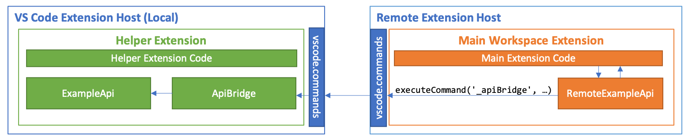
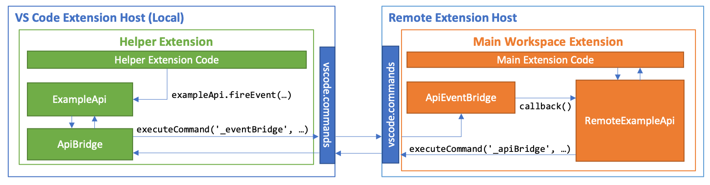

# VS Code Remote Development Helper Extension Samples

<table style="width: 100%; border-style: none;"><tr>
<td style="width: 140px; text-align: center;"><a href="https://aka.ms/vscode-remote/download/extension"></a></td>
<td>
<strong>Visual Studio Code Remote Development</strong><br />
<i>Open any folder in a container, on a remote machine, or in WSL and take advantage of VS Code's full feature set. <strong><a href="https://aka.ms/vscode-remote">Learn more!</a></strong><br />
<strong><a href="https://aka.ms/vscode-remote/download/extension"></a></strong></i>
</td>
</tr></table>

## About the Samples

While many extensions will work with VS Code Remote Development unmodified, some extensions will need to be changed to function as expected. The [VS Code Remote Development Extension Guide](https://aka.ms/vscode-remote/developing-extensions) covers general guidance and information on using existing APIs. This repository focuses on providing samples for how to get around a few very specific challenges.

> **Note:** These are not offical samples as the VS Code team is still investigating alternate approaches to accomplish what is described here.

When developing remotely, VS Code will attempt to infer where to install an extension, locally or remotely, based on the functionality it exposes. Extensions fall into one of two categories:

* UI Extensions are installed locally. These extensions only customize the UI and do not access files in a workspace, which means they can run entirely on the local machine. Since they are installed locally, they are always available to you independent of the workspace you are working in. Examples of UI extensions are themes, snippets, language grammars, and keymaps.

* Workspace Extensions are installed remotely. They access files and folders in a workspace for editing, to provide IntelliSense (completions), go-to-definition, debugging, and more. These extensions run remotely so that they have full access to the file system and tools on the remote host. While Workspace extensions do not focus on UI customization, they can contribute explorers, views, and other UI elements as well.


Some extensions are not cleanly classifiable as a purely Workspace Extension or as a purely UI extension. For example, a Workspace Extension may rely on local, non-VS Code provided APIs, commands, modules, or runtimes. Or a UI Extension may have some features that interact directly with remote workspace files. For cases such as these, you can split your extension into a workspace component and UI component using a "Helper" extension.

A "Helper" extension encapsulates the external functionality that your main extension needs and exposes this as a private API using VS Code commands. Your main Workspace or UI Extension can then communicate with the Helper extension using these commands, with VS Code automatically routing the commands to wherever the Helper extension happens to be running.

### Contents

This repository includes a are a few examples of how "Helper" extensions can be used and how to implement them:

* **[Basic Helper Extension](./helper-extension)**
* **[Proxying an existing API - Basic](./remote-api)**
* **[Proxying an existing API - API Class w/Events](./remote-api-with-events)**

Read on if you'd like a summary how each works.

## Summary

### Basic Helper Extension

Let's start with a basic "Helper" Extension. Here we will surface an "echo" command defined by a UI Helper Extension so that it can be invoked by our main Workspace Extension.


The key to defining a helper extension is setting `"api": "none"` in its `package.json`, which lets both UI and Workspace Extensions add the helper as an extension dependency.

package.json (Helper Extension):

```json
{
    "name": "helper-extension",
    "extensionKind": "ui",
    "api":"none",
    "activationEvents": [
        "onCommand:_helper-extension.echo"
    ]
}
```

Setting `"api": "none"` tells VS Code that it can safely ignore any synchronous APIs returned as a part of the extension's activation function, since all cross-extension communication with it will be done using commands.

While the Helper Extension's `package.json` above activates when the `_helper-extension.echo` command is executed, the command is private and has not been added to the extension's contributions. Instead, we will register the command in our extension's `activate` function so that it can be used by our Workspace Extension:

extension.ts (Helper Extension):

```typescript
import * as vscode from 'vscode';

export async function activate(context: vscode.ExtensionContext) {
    // Register the private echo command
    const echoCommand = vscode.commands.registerCommand('_helper-extension.echo',
        (value: string) => {
            vscode.window.showInformationMessage(`Main extension said, "${msg}"`);
        }
    );
    context.subscriptions.push(echoCommand);
}
```

Now our main Workspace Extension can add the Helper Extension as a dependency. Once both extensions are published to the marketplace, installing the main Workspace Extension will install the Helper Extension as well.

package.json (Main Workspace Extension):

```json
{
    "name": "main-extension",
    "extensionKind": "workspace",
    "extensionDependencies": [
       "helper-extension"
    ]
}
```

To communicate with the Helper Extension, our workspace extension invokes the private `_helper-extension.echo` command:

extension.ts (Main Workspace Extension):

```typescript
import * as vscode from 'vscode';

export async function activate(context: vscode.ExtensionContext) {
    // Invoke the echo command on the helper extension
    await vscode.commands.executeCommand('_helper-extension.echo', 'Hello!');
}
```

You can find the complete example [here](./helper-extension).

### Proxying an existing API

In some cases, you may have an existing node module that is used in many places in your extension and updating each location to use a command is too time-consuming. If you are only using async functions on the module (or these functions return a promise), you can create a drop-in replacement **proxy API module** that executes an **API Bridge** command in a Helper Extension to call the actual API.



For example, imagine the [simple echo command above](#basic-helper-extension) was part of common node module.

example-api.ts:

```typescript
import * as vscode from 'vscode';

export async function echo(msg: string): Promise<void> {
    await vscode.window.showInformationMessage(`Main extension said, "${msg}"`);
}

export async function setEchoTimer(msg: string, delay: number): Promise<void> {
    return new Promise((resolve, reject) => {
        setTimeout(async () => {
            await echo(msg);
            resolve();
        }, delay);
    });
}

```

To allow this API to be called remotely, the [Helper Extension](#accessing-local-apis-using-a-helper-extension) can be modified to introduce a private **API Bridge** command designed to call any method on the API surface.

extension.ts (Helper Extension):

```typescript
import * as vscode from 'vscode';
import * as exampleApi from './example-api';

export async function activate(context: vscode.ExtensionContext) {
    // First arg is API function name, all of the function's expected arguments then follow it.
    const callCommand = vscode.commands.registerCommand('_remote-api.apiBridge', (...args: any[]) => {
            const fnName = args[0];
            const fnArgs = Array.prototype.slice.call(args, 1);
            // Call the remoteApi function by name
            return (<any>exampleApi)[fnName](...fnArgs);
        }
    );
    context.subscriptions.push(callCommand);
}
```

Next, we will create a drop-in replacement proxy node module that mirrors the API's function signatures but calls the API Bridge instead.

remote-example-api.ts (Replacement Node Module - Main Extension):

```typescript
import * as vscode from 'vscode';

// Use identical signature to echo in the original example-api module
export async function echo(message: string): Promise<void> {
    return await vscode.commands.executeCommand('_remote-api.apiBridge','echo', value);
}

// This time for a different function with more arguments
export async function setEchoTimer(message: string, delay: Number): Promise<void> {
    return await vscode.commands.executeCommand('_remote-api.apiBridge','setEchoTimer', message, delay);
 }
```

Finally, we update any imports that reference `example-api` in the main Workspace Extension to `remote-example-api`. At this point, the main extension will function like it did before but the API's function calls will be executed on the UI side instead.

extension.ts (Main Workspace Extension):

```typescript
import * as vscode from 'vscode';
import * as exampleApi from 'remote-example-api'; // Change the import

export async function activate(context: vscode.ExtensionContext) {
        // Existing exampleApi calls all now work, but will execute on the UI side!
        await exampleApi.echo('Hello! I will ping you again in 10 seconds.');
        await exampleApi.setEchoTimer('Hello again!', 10000);
}
```

You can find the complete example [here](./remote-api).

### Proxying APIs with Events

A more difficult situation arises if you need to remotely access an API that has an event. These bi-directional APIs often use objects instead of straight modules, which further complicates things. To resolve these challenges, you can use a pattern that establishes an **API Bridge** command in a Helper Extension and an **Event Bridge** in your main extension that handles the execution of event callbacks.



Under this model, the Helper Extension's API Bridge associates a unique identifier with each instance of the API object that is created. The API Bridge exposes a command that allows the main extension to call functions for a given API instance using this identifier. For functions that register event callbacks, the API Bridge uses a stub callback function that executes a command on the Event Bridge.

extension.ts (Helper Extension w/API Bridge):

```typescript
const apiObjs: any = {};

export async function activate(context: vscode.ExtensionContext) {
    const apiBridge = vscode.commands.registerCommand('_example-api.apiBridge', (...args: any[]) => {

        // First arg is instance ID, second is the function name
        const instanceId = args[0];
        const fnName = args[1];

        // Get the instance or if the ID is new, create one.
        apiObjs[instanceId] = apiObjs[instanceId] || new ExampleApi();

        // If the function is one that registers an event, use a replacement callback
        if (fnName === 'registerEventHandler') {
            const eventName = args[2];
            const callbackId = args[3];
            // Trigger the callback via the Event Bridge
            return apiObjs[instanceId].registerEventHandler(eventName, (eventName: string, value?: string) => {
                return vscode.commands.executeCommand(`_example-api.eventBridge`, callbackId, eventName, value);
            });
        }

        // Otherwise call the appropriate function
        return apiObjs[instanceId][fnName](...Array.prototype.slice.call(args,2));
    });
    context.subscriptions.push(apiBridge);
}
```

The main extension then uses a **proxy class** (similar to one in the [the proxy module above](#proxying-an-existing-api) that mirrors the API class's function signatures, but instead executes commands on the API Bridge. The main extension then also exposes an Event Bridge command that fires callback functions registered using the proxy class. The proxy class's event registration functions associate the passed in callback function with an identifier. This identifier is then passed to the API Bridge to register the remote callback. When an event fires, the API Bridge executes the Event Bridge command and passes in this identifier so the appropriate callback can be invoked.

remote-example-api.ts (Replacement Node Module w/Event Bridge - Main Extension):

```typescript
const eventHandlers: any = {};

// Register the Event Bridge
vscode.commands.registerCommand(`_example-api.eventBridge`,
    (callbackId: string, eventName: string, value?: string): void => {
        eventHandlers[callbackId](eventName, value);
    });

export class RemoteExampleApi {

    private instanceId = uuid();

    // Generate a callbackId and register it with the API Bridge
    public async registerEventHandler(eventName: string, callback: (eventName: string, value?: string) => void): Promise<void> {
        const callbackId = uuid();
        eventHandlers[callbackId] = callback;
        return vscode.commands.executeCommand('_example-api.apiBridge', moduleId, this.instanceId, 'registerEventHandler', eventName, callbackId);
    }

    // etc...
}
```

This pattern can be abstracted so it can easily be reused with multiple classes and extensions, but a full example is too lengthy for documentation, so check out the complete example for more details.

You can find the complete example [here](./remote-api-with-events).

## License

Copyright (c) Microsoft Corporation. All rights reserved.

Licensed under the [MIT](LICENSE) License.
